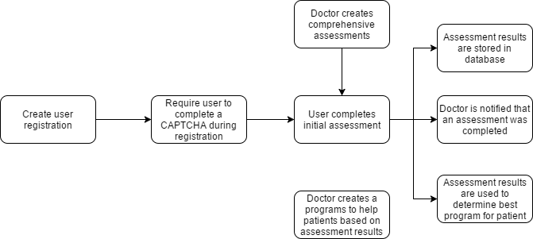

# Sprint Planning

By the time the new sprint is approaching the backlog should be groomed, tasks assessed and resources checked.

We have discussed the importance of ensuring our teams are healthy and well distributed with high coverage. At the time of sprint planning the
metrics used when assessing your team resources should be updated to best reflect their capacity.

In the event that a team isn't as balanced as you would like you must take into account the type of tasks that will be part of the next sprint. If a
resource will be unavailable in the next sprint it may be possible that a task would have been that individuals primary responsibility. The question
is do you try to implement the task without that resource present, or prolong the task until the resource returns. This is challenging because
depending on the task and the team's coverage the learning curve and possibility of yielding an error will be significantly higher. This is something
that will need to be assessed on a case by case basis.

Tasks can relate to each other in several ways. A few relationships are:

* Blocker - Task #1 must be completed prior to Task #2 being started
* Resolves - Task #2 resolves Task #1, making Task #2 complete
* Duplicates - Simply already reporting a reported task
* Causes - A given task causes this task to be implemented

Some of these relationships:

What can facilitate this decision is by attempting to understand the dependencies that may exist between existing components as well as tasks for
future work. Knowledge of upcoming changes may and very often will shape the design and timing of a given task. There is a balance between
the now and later.

Here is the golden rule. Think of the future: migrations, refactoring, all that will be required to change if something is done in a more simplistic
manner rather than a more structured well architect-ed solution. It is important to voice the differences in the immediate and long-term to the PO,
providing a delta in LOE. Due dates may make it impossible to do things "right" the first time around. Proper foresight may enable you to design a
middle of the path solution that will be easier to refactor in the near future. Don't think it will be the other guys problem, beyond the fact that you
may be the other guy. Don't be ridiculous and say I followed the requirement to letter no more, no less. Discuss the possible pros and cons of the
requirements when in the massaging phase. What should never happen is an unexpected refactor. The limitation of that design should have been
clearly though through when planning the sprint.

Take from this that you need to be able to think about the connections between this task and the future. The PO should know the upcoming
business requirements and whether or not a task should be put in this sprint, and how much of the current and future needs should be taken into
account when designing this task.

### Level of effort
Time estimates are what the business wants. What is the point of giving time estimates that are inaccurate. To account for this teams and PM will
apply various techniques to provide a buffer to their estimates. This just further dilutes the numbers and their accuracy. It is far more important toexpress the complexity of the individual tasks. Levels of unknowns with given tasks. A task may have no unknowns at all. The technologies and
code-base may be well known to the team. When tasks have been performed in the past it may be possible to compare past efforts to future
estimates. This number should be weighed in with the level of unknowns and the blockers of the sprint.

The outcome of this is fairly simple. For tasks that are isolated, have little or no unknowns and are easy to breakdown into small assignable
technical tasks, here time estimates can be used. For every technical task there is more that must be performed then the implementation alone.
This will be further illustrated in the definition of done section.
